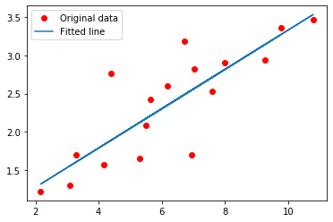

# Linear Regression Example

Linear regression implementation with TensorFlow v2 library.

This example is using a low-level approach to better understand all mechanics behind the training process.

- Author: Aymeric Damien
- Project: https://github.com/aymericdamien/TensorFlow-Examples/


```python
from __future__ import absolute_import, division, print_function
```


```python
import tensorflow as tf
import numpy as np
rng = np.random
```


```python
# Parameters.
learning_rate = 0.01
training_steps = 1000
display_step = 50
```


```python
# Training Data.
X = np.array([3.3,4.4,5.5,6.71,6.93,4.168,9.779,6.182,7.59,2.167,
              7.042,10.791,5.313,7.997,5.654,9.27,3.1])
Y = np.array([1.7,2.76,2.09,3.19,1.694,1.573,3.366,2.596,2.53,1.221,
              2.827,3.465,1.65,2.904,2.42,2.94,1.3])

```


```python
# Weight and Bias, initialized randomly.
W = tf.Variable(rng.randn(), name="weight")
b = tf.Variable(rng.randn(), name="bias")

# Linear regression (Wx + b).
def linear_regression(x):
    return W * x + b

# Mean square error.
def mean_square(y_pred, y_true):
    return tf.reduce_mean(tf.square(y_pred - y_true))

# Stochastic Gradient Descent Optimizer.
optimizer = tf.optimizers.SGD(learning_rate)
```


```python
# Optimization process. 
def run_optimization():
    # Wrap computation inside a GradientTape for automatic differentiation.
    with tf.GradientTape() as g:
        pred = linear_regression(X)
        loss = mean_square(pred, Y)

    # Compute gradients.
    gradients = g.gradient(loss, [W, b])
    
    # Update W and b following gradients.
    optimizer.apply_gradients(zip(gradients, [W, b]))
```


```python
# Run training for the given number of steps.
for step in range(1, training_steps + 1):
    # Run the optimization to update W and b values.
    run_optimization()
    
    if step % display_step == 0:
        pred = linear_regression(X)
        loss = mean_square(pred, Y)
        print("step: %i, loss: %f, W: %f, b: %f" % (step, loss, W.numpy(), b.numpy()))
```

    step: 50, loss: 0.171628, W: 0.305076, b: 0.419926
    step: 100, loss: 0.167794, W: 0.298961, b: 0.463283
    step: 150, loss: 0.164787, W: 0.293545, b: 0.501678
    step: 200, loss: 0.162429, W: 0.288749, b: 0.535680
    step: 250, loss: 0.160579, W: 0.284502, b: 0.565790
    step: 300, loss: 0.159129, W: 0.280741, b: 0.592455
    step: 350, loss: 0.157991, W: 0.277410, b: 0.616069
    step: 400, loss: 0.157099, W: 0.274460, b: 0.636980
    step: 450, loss: 0.156400, W: 0.271848, b: 0.655498
    step: 500, loss: 0.155851, W: 0.269535, b: 0.671897
    step: 550, loss: 0.155421, W: 0.267487, b: 0.686419
    step: 600, loss: 0.155084, W: 0.265673, b: 0.699280
    step: 650, loss: 0.154819, W: 0.264066, b: 0.710669
    step: 700, loss: 0.154612, W: 0.262644, b: 0.720754
    step: 750, loss: 0.154449, W: 0.261384, b: 0.729685
    step: 800, loss: 0.154321, W: 0.260268, b: 0.737594
    step: 850, loss: 0.154221, W: 0.259280, b: 0.744599
    step: 900, loss: 0.154143, W: 0.258405, b: 0.750802
    step: 950, loss: 0.154081, W: 0.257631, b: 0.756294
    step: 1000, loss: 0.154033, W: 0.256945, b: 0.761159


```python
import matplotlib.pyplot as plt
```


```python
# Graphic display
plt.plot(X, Y, 'ro', label='Original data')
plt.plot(X, np.array(W * X + b), label='Fitted line')
plt.legend()
plt.show()
```





```python

```
