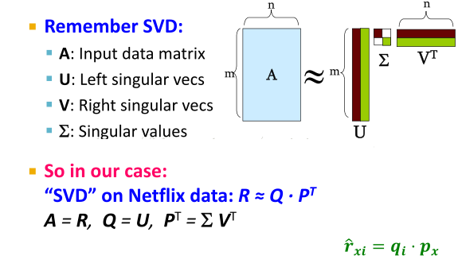
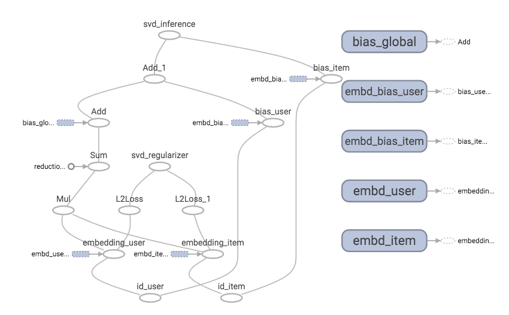

## 前言


真实的场景中，可能我们有非常非常多的训练数据，我们不得不面对一些问题，也是大家比较关心的问题。

1）海量的数据无法一次载入内存用于训练。<br>
2）数据是每天不断增加的，我们有没有一些增量训练的方式去不断持续迭代更新模型？

什么场景下，我们是不把数据全部载入内存优化，而是一个batch一个batch输入进行update参数的？<br>
对，我们用tensorflow来完成一个在批量数据上更新，并且可以增量迭代优化的矩阵分解推荐系统。

## 0.矩阵分解回顾


LFM：把用户再item上打分的行为，看作是有内部依据的，认为和k个factor有关系<br>
每一个user i会有一个用户的向量(k维)，每一个item会有一个item的向量(k维)

SVD是矩阵分解的一种方式

### 预测公式如下
$y_{pred[u, i]} = bias_{global} + bias_{user[u]} + bias_{item_[i]} + <embedding_{user[u]}, embedding_{item[i]}>$

### 我们需要最小化的loss计算如下（添加正则化项）
$\sum_{u, i} |y_{pred[u, i]} - y_{true[u, i]}|^2 + \lambda(|embedding_{user[u]}|^2 + |embedding_{item[i]}|^2)$

## 1.获取数据

咱们依旧以movielens为例，数据格式为**user item rating timestamp**


```python
#这部分代码大家不用跑，因为数据已经下载好了
#!wget http://files.grouplens.org/datasets/movielens/ml-1m.zip
#!sudo unzip ml-1m.zip -d ./movielens
```

## 2.数据处理部分

咱们写点代码完成数据的产出和预处理过程。<br>
大家知道tensorflow搭建的模型，训练方式通常是一个batch一个batch训练的。


```python
import numpy as np
import pandas as pd


def read_data_and_process(filname, sep="\t"):
    col_names = ["user", "item", "rate", "st"]
    df = pd.read_csv(filname, sep=sep, header=None, names=col_names, engine='python')
    df["user"] -= 1
    df["item"] -= 1
    for col in ("user", "item"):
        df[col] = df[col].astype(np.int32)
    df["rate"] = df["rate"].astype(np.float32)
    return df


class ShuffleDataIterator(object):
    """
    随机生成一个batch一个batch数据
    """
    #初始化
    def __init__(self, inputs, batch_size=10):
        self.inputs = inputs
        self.batch_size = batch_size
        self.num_cols = len(self.inputs)
        self.len = len(self.inputs[0])
        self.inputs = np.transpose(np.vstack([np.array(self.inputs[i]) for i in range(self.num_cols)]))

    #总样本量
    def __len__(self):
        return self.len

    def __iter__(self):
        return self

    #取出下一个batch
    def __next__(self):
        return self.next()
    
    #随机生成batch_size个下标，取出对应的样本
    def next(self):
        ids = np.random.randint(0, self.len, (self.batch_size,))
        out = self.inputs[ids, :]
        return [out[:, i] for i in range(self.num_cols)]


class OneEpochDataIterator(ShuffleDataIterator):
    """
    顺序产出一个epoch的数据，在测试中可能会用到
    """
    def __init__(self, inputs, batch_size=10):
        super(OneEpochDataIterator, self).__init__(inputs, batch_size=batch_size)
        if batch_size > 0:
            self.idx_group = np.array_split(np.arange(self.len), np.ceil(self.len / batch_size))
        else:
            self.idx_group = [np.arange(self.len)]
        self.group_id = 0

    def next(self):
        if self.group_id >= len(self.idx_group):
            self.group_id = 0
            raise StopIteration
        out = self.inputs[self.idx_group[self.group_id], :]
        self.group_id += 1
        return [out[:, i] for i in range(self.num_cols)]
```

## 3.模型搭建

我们按照下图的方式用tensorflow去搭建一个可增量训练的矩阵分解模型，完成基于矩阵分解的推荐系统。



```python
import tensorflow as tf

# 使用矩阵分解搭建的网络结构
def inference_svd(user_batch, item_batch, user_num, item_num, dim=5, device="/cpu:0"):
    #使用CPU
    with tf.device("/cpu:0"):
        # 初始化几个bias项
        global_bias = tf.get_variable("global_bias", shape=[])
        w_bias_user = tf.get_variable("embd_bias_user", shape=[user_num])
        w_bias_item = tf.get_variable("embd_bias_item", shape=[item_num])
        # bias向量
        bias_user = tf.nn.embedding_lookup(w_bias_user, user_batch, name="bias_user")
        bias_item = tf.nn.embedding_lookup(w_bias_item, item_batch, name="bias_item")
        w_user = tf.get_variable("embd_user", shape=[user_num, dim],
                                 initializer=tf.truncated_normal_initializer(stddev=0.02))
        w_item = tf.get_variable("embd_item", shape=[item_num, dim],
                                 initializer=tf.truncated_normal_initializer(stddev=0.02))
        # user向量与item向量
        embd_user = tf.nn.embedding_lookup(w_user, user_batch, name="embedding_user")
        embd_item = tf.nn.embedding_lookup(w_item, item_batch, name="embedding_item")
    with tf.device(device):
        # 按照实际公式进行计算
        # 先对user向量和item向量求内积
        infer = tf.reduce_sum(tf.multiply(embd_user, embd_item), 1)
        # 加上几个偏置项
        infer = tf.add(infer, global_bias)
        infer = tf.add(infer, bias_user)
        infer = tf.add(infer, bias_item, name="svd_inference")
        # 加上正则化项
        regularizer = tf.add(tf.nn.l2_loss(embd_user), tf.nn.l2_loss(embd_item), name="svd_regularizer")
    return infer, regularizer

# 迭代优化部分
def optimization(infer, regularizer, rate_batch, learning_rate=0.001, reg=0.1, device="/cpu:0"):
    global_step = tf.train.get_global_step()
    assert global_step is not None
    # 选择合适的optimizer做优化
    with tf.device(device):
        cost_l2 = tf.nn.l2_loss(tf.subtract(infer, rate_batch))
        penalty = tf.constant(reg, dtype=tf.float32, shape=[], name="l2")
        cost = tf.add(cost_l2, tf.multiply(regularizer, penalty))
        train_op = tf.train.AdamOptimizer(learning_rate).minimize(cost, global_step=global_step)
    return cost, train_op
```

## 4.数据上的模型训练


```python
import time
from collections import deque

import numpy as np
import tensorflow as tf
from six import next
from tensorflow.core.framework import summary_pb2

np.random.seed(13575)

# 一批数据的大小
BATCH_SIZE = 2000
# 用户数
USER_NUM = 6040
# 电影数
ITEM_NUM = 3952
# factor维度
DIM = 15
# 最大迭代轮数
EPOCH_MAX = 200
# 使用cpu做训练
DEVICE = "/cpu:0"

# 截断
def clip(x):
    return np.clip(x, 1.0, 5.0)

# 这个是方便Tensorboard可视化做的summary
def make_scalar_summary(name, val):
    return summary_pb2.Summary(value=[summary_pb2.Summary.Value(tag=name, simple_value=val)])

# 调用上面的函数获取数据
def get_data():
    df = read_data_and_process("./data/movielens/ml-1m/ratings.dat", sep="::")
    rows = len(df)
    df = df.iloc[np.random.permutation(rows)].reset_index(drop=True)
    split_index = int(rows * 0.9)
    df_train = df[0:split_index]
    df_test = df[split_index:].reset_index(drop=True)
    print(df_train.shape, df_test.shape)
    return df_train, df_test

# 实际训练过程
def svd(train, test):
    samples_per_batch = len(train) // BATCH_SIZE

    # 一批一批数据用于训练
    iter_train = ShuffleDataIterator([train["user"],
                                         train["item"],
                                         train["rate"]],
                                        batch_size=BATCH_SIZE)
    # 测试数据
    iter_test = OneEpochDataIterator([test["user"],
                                         test["item"],
                                         test["rate"]],
                                        batch_size=-1)
    # user和item batch
    user_batch = tf.placeholder(tf.int32, shape=[None], name="id_user")
    item_batch = tf.placeholder(tf.int32, shape=[None], name="id_item")
    rate_batch = tf.placeholder(tf.float32, shape=[None])

    # 构建graph和训练
    infer, regularizer = inference_svd(user_batch, item_batch, user_num=USER_NUM, item_num=ITEM_NUM, dim=DIM,
                                           device=DEVICE)
    global_step = tf.contrib.framework.get_or_create_global_step()
    _, train_op = optimization(infer, regularizer, rate_batch, learning_rate=0.001, reg=0.05, device=DEVICE)

    # 初始化所有变量
    init_op = tf.global_variables_initializer()
    # 开始迭代
    with tf.Session() as sess:
        sess.run(init_op)
        summary_writer = tf.summary.FileWriter(logdir="/tmp/svd/log", graph=sess.graph)
        print("{} {} {} {}".format("epoch", "train_error", "val_error", "elapsed_time"))
        errors = deque(maxlen=samples_per_batch)
        start = time.time()
        for i in range(EPOCH_MAX * samples_per_batch):
            users, items, rates = next(iter_train)
            _, pred_batch = sess.run([train_op, infer], feed_dict={user_batch: users,
                                                                   item_batch: items,
                                                                   rate_batch: rates})
            pred_batch = clip(pred_batch)
            errors.append(np.power(pred_batch - rates, 2))
            if i % samples_per_batch == 0:
                train_err = np.sqrt(np.mean(errors))
                test_err2 = np.array([])
                for users, items, rates in iter_test:
                    pred_batch = sess.run(infer, feed_dict={user_batch: users,
                                                            item_batch: items})
                    pred_batch = clip(pred_batch)
                    test_err2 = np.append(test_err2, np.power(pred_batch - rates, 2))
                end = time.time()
                test_err = np.sqrt(np.mean(test_err2))
                print("{:3d} {:f} {:f} {:f}(s)".format(i // samples_per_batch, train_err, test_err,
                                                       end - start))
                train_err_summary = make_scalar_summary("training_error", train_err)
                test_err_summary = make_scalar_summary("test_error", test_err)
                summary_writer.add_summary(train_err_summary, i)
                summary_writer.add_summary(test_err_summary, i)
                start = end
```


```python
# 获取数据
df_train, df_test = get_data()
```


```python
# 完成实际的训练
svd(df_train, df_test)
```
