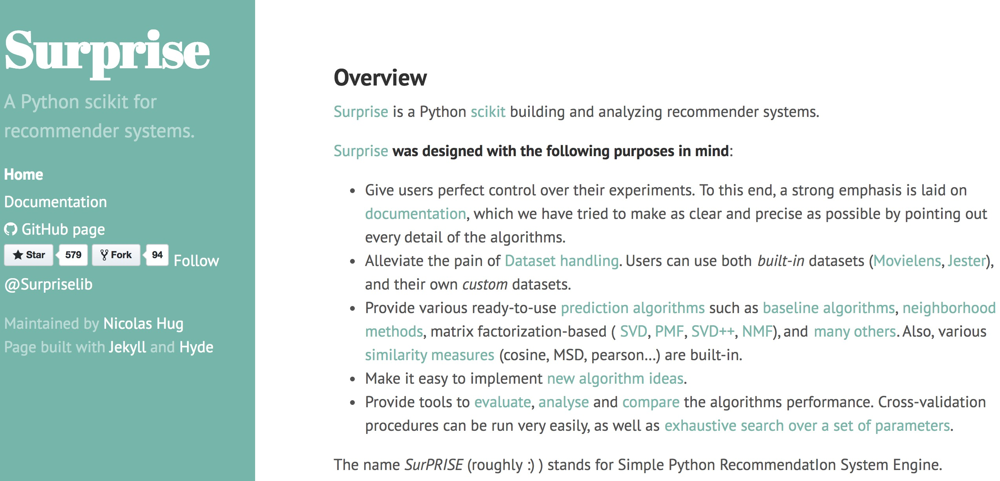

## python推荐系统库Surprise



在推荐系统的建模过程中，我们将用到python库 [Surprise(Simple Python RecommendatIon System Engine)](https://github.com/NicolasHug/Surprise)，是scikit系列中的一个(很多同学用过scikit-learn和scikit-image等库)。

### 简单易用，同时支持多种推荐算法：
* [基础算法/baseline algorithms](http://surprise.readthedocs.io/en/stable/basic_algorithms.html)
* [基于近邻方法(协同过滤)/neighborhood methods](http://surprise.readthedocs.io/en/stable/knn_inspired.html)
* [矩阵分解方法/matrix factorization-based (SVD, PMF, SVD++, NMF)](http://surprise.readthedocs.io/en/stable/matrix_factorization.html#surprise.prediction_algorithms.matrix_factorization.SVD)

| 算法类名        | 说明  |
| ------------- |:-----|
|[random_pred.NormalPredictor](http://surprise.readthedocs.io/en/stable/basic_algorithms.html#surprise.prediction_algorithms.random_pred.NormalPredictor)|Algorithm predicting a random rating based on the distribution of the training set, which is assumed to be normal.|
|[baseline_only.BaselineOnly](http://surprise.readthedocs.io/en/stable/basic_algorithms.html#surprise.prediction_algorithms.baseline_only.BaselineOnly)|Algorithm predicting the baseline estimate for given user and item.|
|[knns.KNNBasic](http://surprise.readthedocs.io/en/stable/knn_inspired.html#surprise.prediction_algorithms.knns.KNNBasic)|A basic collaborative filtering algorithm.|
|[knns.KNNWithMeans](http://surprise.readthedocs.io/en/stable/knn_inspired.html#surprise.prediction_algorithms.knns.KNNWithMeans)|A basic collaborative filtering algorithm, taking into account the mean ratings of each user.|
|[knns.KNNBaseline](http://surprise.readthedocs.io/en/stable/knn_inspired.html#surprise.prediction_algorithms.knns.KNNBaseline)|A basic collaborative filtering algorithm taking into account a baseline rating.|	
|[matrix_factorization.SVD](http://surprise.readthedocs.io/en/stable/matrix_factorization.html#surprise.prediction_algorithms.matrix_factorization.SVD)|The famous SVD algorithm, as popularized by Simon Funk during the Netflix Prize.|
|[matrix_factorization.SVDpp](http://surprise.readthedocs.io/en/stable/matrix_factorization.html#surprise.prediction_algorithms.matrix_factorization.SVDpp)|The SVD++ algorithm, an extension of SVD taking into account implicit ratings.|
|[matrix_factorization.NMF](http://surprise.readthedocs.io/en/stable/matrix_factorization.html#surprise.prediction_algorithms.matrix_factorization.NMF)|A collaborative filtering algorithm based on Non-negative Matrix Factorization.|
|[slope_one.SlopeOne](http://surprise.readthedocs.io/en/stable/slope_one.html#surprise.prediction_algorithms.slope_one.SlopeOne)|A simple yet accurate collaborative filtering algorithm.|
|[co_clustering.CoClustering](http://surprise.readthedocs.io/en/stable/co_clustering.html#surprise.prediction_algorithms.co_clustering.CoClustering)|A collaborative filtering algorithm based on co-clustering.|

### 其中基于近邻的方法(协同过滤)可以设定不同的度量准则。

| 相似度度量标准 | 度量标准说明  |
| ------------- |:-----|
|[cosine](http://surprise.readthedocs.io/en/stable/similarities.html#surprise.similarities.cosine)|Compute the cosine similarity between all pairs of users (or items).|
|[msd](http://surprise.readthedocs.io/en/stable/similarities.html#surprise.similarities.msd)|Compute the Mean Squared Difference similarity between all pairs of users (or items).|
|[pearson](http://surprise.readthedocs.io/en/stable/similarities.html#surprise.similarities.pearson)|Compute the Pearson correlation coefficient between all pairs of users (or items).|
|[pearson_baseline](http://surprise.readthedocs.io/en/stable/similarities.html#surprise.similarities.pearson_baseline)|Compute the (shrunk) Pearson correlation coefficient between all pairs of users (or items) using baselines for centering instead of means.|

#### Jaccard similarity
交集元素个数/并集元素个数

### 支持不同的评估准则
| 评估准则 | 准则说明  |
| ------------- |:-----|
|[rmse](http://surprise.readthedocs.io/en/stable/accuracy.html#surprise.accuracy.rmse)|Compute RMSE (Root Mean Squared Error).|
|[msd](http://surprise.readthedocs.io/en/stable/similarities.html#surprise.similarities.msd)|Compute MAE (Mean Absolute Error).|
|[fcp](http://surprise.readthedocs.io/en/stable/accuracy.html#surprise.accuracy.fcp)|Compute FCP (Fraction of Concordant Pairs).|

### 使用示例

#### 基本使用方法如下

```python
# 可以使用上面提到的各种推荐系统算法
from surprise import SVD
from surprise import Dataset
from surprise import evaluate, print_perf

# 默认载入movielens数据集
data = Dataset.load_builtin('ml-100k')
# k折交叉验证(k=3)
data.split(n_folds=3)
# 试一把SVD矩阵分解
algo = SVD()
# 在数据集上测试一下效果
perf = evaluate(algo, data, measures=['RMSE', 'MAE'])
#输出结果
print_perf(perf)
```

#### 载入自己的数据集方法

```python
# 指定文件所在路径
file_path = os.path.expanduser('~/.surprise_data/ml-100k/ml-100k/u.data')
# 告诉文本阅读器，文本的格式是怎么样的
reader = Reader(line_format='user item rating timestamp', sep='\t')
# 加载数据
data = Dataset.load_from_file(file_path, reader=reader)
# 手动切分成5折(方便交叉验证)
data.split(n_folds=5)
```

#### 算法调参(让推荐系统有更好的效果)

这里实现的算法用到的算法无外乎也是SGD等，因此也有一些超参数会影响最后的结果，我们同样可以用sklearn中常用到的网格搜索交叉验证(GridSearchCV)来选择最优的参数。简单的例子如下所示：

```python
# 定义好需要优选的参数网格
param_grid = {'n_epochs': [5, 10], 'lr_all': [0.002, 0.005],
              'reg_all': [0.4, 0.6]}
# 使用网格搜索交叉验证
grid_search = GridSearch(SVD, param_grid, measures=['RMSE', 'FCP'])
# 在数据集上找到最好的参数
data = Dataset.load_builtin('ml-100k')
data.split(n_folds=3)
grid_search.evaluate(data)
# 输出调优的参数组 
# 输出最好的RMSE结果
print(grid_search.best_score['RMSE'])
# >>> 0.96117566386

# 输出对应最好的RMSE结果的参数
print(grid_search.best_params['RMSE'])
# >>> {'reg_all': 0.4, 'lr_all': 0.005, 'n_epochs': 10}

# 最好的FCP得分
print(grid_search.best_score['FCP'])
# >>> 0.702279736531

# 对应最高FCP得分的参数
print(grid_search.best_params['FCP'])
# >>> {'reg_all': 0.6, 'lr_all': 0.005, 'n_epochs': 10}
```


```python

```


```python

```
